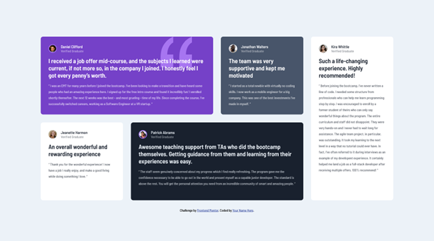

# Frontend Mentor - Testimonials grid section solution

This is a solution to the [Testimonials grid section challenge on Frontend Mentor](https://www.frontendmentor.io/challenges/testimonials-grid-section-Nnw6J7Un7). Frontend Mentor challenges help you improve your coding skills by building realistic projects. 

## Overview

### The challenge

Users should be able to:

- View the optimal layout for the site depending on their device's screen size

### Screenshot




### Links

- Solution URL: [Add solution URL here](https://your-solution-url.com)
- Live Site URL: [Add live site URL here](https://your-live-site-url.com)

## My process

### Built with

- Semantic HTML5 markup
- CSS custom properties
- Flexbox
- CSS Grid
- Mobile-first workflow

### What I learned

Use this section to recap over some of your major learnings while working through this project. Writing these out and providing code samples of areas you want to highlight is a great way to reinforce your own knowledge.

To see how you can add code snippets, see below:

```html
<h1>Some HTML code I'm proud of</h1>
```
```css
.proud-of-this-css {
  color: papayawhip;
}
```
```js
const proudOfThisFunc = () => {
  console.log('🎉')
}
```

If you want more help with writing markdown, we'd recommend checking out [The Markdown Guide](https://www.markdownguide.org/) to learn more.

**Note: Delete this note and the content within this section and replace with your own learnings.**

### Continued development


### Useful resources

## Author

- Frontend Mentor - [@toshirokubota](https://www.frontendmentor.io/profile/toshirokubota)

## Acknowledgments

